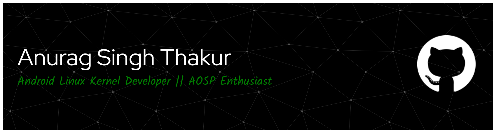

<h3>$\color[RGB]{0,125,0}{\textbf{\textrm{💫 Greetings, I'm Anurag}}}$</h3>
 
 

<h3>$\color[RGB]{0,125,0}{\textbf{\textrm{A passionate Linux Developer || AOSP Enthusiast from India}}}$</h3>

$\color[RGB]{0,125,0}{\textbf{\textrm{- 🔭 I’m currently working on: Android Linux Kernel and Performance Optimisation}}}$

$\color[RGB]{0,125,0}{\textbf{\textrm{- 🌱 I’m currently learning: Scheduler Algorithm Principles}}}$

$\color[RGB]{0,125,0}{\textbf{\textrm{- 👯 I’m looking to collaborate on: Post Linking Optimisations}}}$

$\color[RGB]{0,125,0}{\textbf{\textrm{- 🤔 I’m looking for help with: Post Linking Optimisations without EmbeddedTraceMacrocell [Instrumented]}}}$

$\color[RGB]{0,125,0}{\textbf{\textrm{- 💬 Ask me about: Linux Kernel [Specially memory and scheduler] }}}$

$\color[RGB]{0,125,0}{\textbf{\textrm{- 📫 How to reach me: Telegram and Email}}}$

$\color[RGB]{0,125,0}{\textbf{\textrm{- 😄 Pronouns: He, Him, irqshake}}}$

$\color[RGB]{0,125,0}{\textbf{\textrm{- ⚡ Fun fact: I love performance and power efficiency}}}$

  <h3>$\color[RGB]{0,125,0}{\textbf{\textrm{🌐 Socials}}}$</h3> 

 

 
 

  <h3>$\color[RGB]{0,125,0}{\textbf{\textrm{💻 Tech Stack}}}$</h3>

<h4>$\color[RGB]{0,125,0}{\textbf{\textrm{Languages:}}}$</h4>

 
         

<h4>$\color[RGB]{0,125,0}{\textbf{\textrm{Tools:}}}$</h4>

 

 
<h4>$\color[RGB]{0,125,0}{\textbf{\textrm{Enviroments:}}}$</h4>

 
           

 

 

  <h3>📊 $\color[RGB]{0,125,0}{\textbf{\textrm{GitHub Stats}}}$</h3>

   
 
 
   

   
   

  

  <h3>🏆 $\color[RGB]{0,125,0}{\textbf{\textrm{GitHub Trophies}}}$</h3>

 

 

  

 

  <h3>📈 $\color[RGB]{0,125,0}{\textbf{\textrm{GitHub Activity}}}$</h3>

  
  
  

<h3>$\color[RGB]{0,125,0}{\textbf{\textrm{Two wrongs don't make a right, but three lefts do — and sometimes two bugs make a feature.}}}$</h3>

<!-- Proudly created with GPRM ( https://gprm.itsvg.in ) -->
